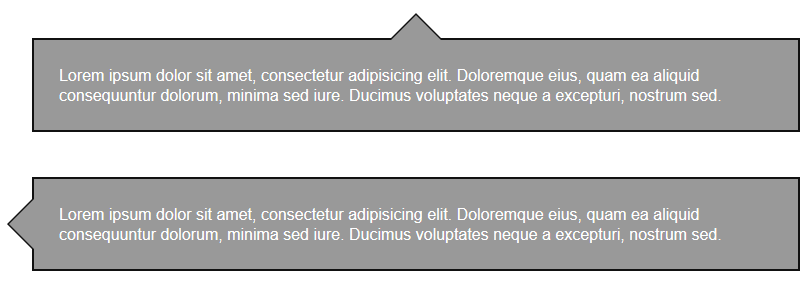

# sass-mixins
Useful Sass mixins

##Mixins Examples
* [CSS Arrow](#css-arrow)
Based on [cssarrowplease](http://www.cssarrowplease.com/)

## CSS Arrow

```scss
.class { 
	// css-arrow(position, arrowSize, BackgroundColor, BorderWidth, BorderColor)
	@include css-arrow('top', 15px, #999, 2px, #111);
	@include css-arrow('left', 15px, #999, 2px, #111);
}
```
The above code will output arrows as below
